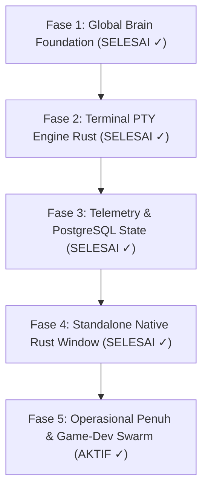

# 🗺️ AI Workstation Development Roadmap: Status & Realisasi Penuh

Dokumen ini adalah peta jalan (roadmap) pengembangan **Irsofka AI Workstation Hub** di Pop!_OS 24.04 LTS COSMIC Desktop.

---

## 🎯 Target Akhir (The End State - TERCAPAI 100% ✓)

Aplikasi GUI Desktop Native mandiri di Pop!_OS COSMIC:
1. **Live Embedded Multi-Viewport Terminal (xterm.js + Portable-PTY)**: Antigravity CLI, Qoder CLI, dan Bash Shell berjalan interaktif secara berdampingan dengan streaming proses berpikir (*live thought process / reasoning tokens*).
2. **Live Telemetry & Resource Bar**: Meteran VRAM NVIDIA RTX 3060, CPU/RAM, active workspace, dan status database.
3. **Mata & Tangan (Local Machine MCP & Wayland Actor)**: Pengambilan screenshot layar COSMIC dan kontrol audio/notifikasi melalui MCP server `local-workstation`.
4. **PostgreSQL 16 & SQLite Game-Like Save State**: Pelacakan level skill, quest log, dan turn-by-turn history.
5. **100% Native Rust Window (Jalur A: Tao + Wry + WebKitGTK 4.1)**: Mandiri tanpa ketergantungan pada browser web (Brave Flatpak dieliminasi total).
6. **Sesi kerja resmi aktif berjalan di dalam aplikasi desktop native ini.**

---

## 🗺️ Status Tahapan Eksekusi

---

### 🟢 Fase 1: Fondasi Global Brain & Rules (SELESAI ✓)
- [x] Struktur direktori terisolasi `~/.ai-station/`.
- [x] Sentralisasi memori dan skill modular (1 filter = 1 file Markdown di `brain/skills/`).
- [x] Sistem self-healing: Error insiden >= 5x otomatis menjadi skill baru.
- [x] CLI hub global `ai-station` di PATH terminal.

---

### 🟢 Fase 2: Terminal PTY Engine & Dual Native Interactive CLI (SELESAI ✓)
- [x] **Rust Native PTY Core**: Biner Rust terkompilasi menggunakan `portable-pty` dan `tokio` multi-thread runtime.
- [x] **Multi-Viewport Independent Terminal**: 3 container DOM terpisah (`#term-qoder`, `#term-antigravity`, `#term-shell`) dengan `xterm.js` rendering 60 FPS.
- [x] **Dual Native Interactive REPL**:
  - Tab 1: Qoder CLI (Qwen 1M Context • 0 Pts) dengan live streaming `Thinking... [reasoning tokens]`.
  - Tab 2: Antigravity CLI (Gemini 3.8 Flash High) dengan live streaming `▾ Thought Process`.
  - Tab 3: COSMIC Shell (`bash -i`).
- [x] **Auto-Recovery Loop**: Sesi CLI yang ditutup otomatis dihidupkan kembali dalam 1 detik.
- [x] **Circular History Buffer**: Replay buffer 128 KB via `/api/term/history` mencegah layar blank saat berpindah tab.
- [x] **PTY Dynamic Resizing**: Endpoint `/api/term/resize` menyesuaikan grid terminal dengan resolusi jendela.

---

### 🟢 Fase 3: Telemetry Bar, Quota & Database Save State (SELESAI ✓)
- [x] Header telemetry bar: Deteksi versi Qoder CLI (`v1.1.65`) dan AGY CLI (`v1.2.17`).
- [x] Monitor hardware real-time: NVIDIA RTX 3060 VRAM, RAM sistem (32 GB), dan disk NVMe.
- [x] Database Enterprise: PostgreSQL 16 berjalan di port `5432` (`irsofka_ai_workstation`) dengan tabel `player_profile`, `skills_inventory`, `quest_tasks`, `world_memory`, dan `session_turns`.
- [x] Dual-engine fallback: Auto-fallback ke SQLite (`~/.ai-station/brain/workstation.db`) jika PostgreSQL offline.

---

### 🟢 Fase 4: Standalone Native Rust Desktop Window - Jalur A (SELESAI ✓)
- [x] **Pemberantasan Dependensi Browser**: Ketergantungan pada Brave Browser Flatpak dihapus 100%.
- [x] **Kompilasi Window Manager Rust**: Menggunakan pustaka Rust `tao` (v0.37) dan `wry` (v0.57) berbasis `webkit2gtk-4.1` dan `gtk+-3.0`.
- [x] **Biner Mandiri 4.9 MB**: `~/.ai-station/bin/irsofka-station-core` dapat berjalan sebagai background daemon (`--headless`) maupun native window.
- [x] **Launcher & Desktop Entry**:
  - `~/.ai-station/bin/launch_gui.sh` membuka biner native secara langsung.
  - Shortcut desktop `~/Desktop/Irsofka AI Workstation.desktop` dan menu aplikasi Pop!_OS COSMIC terhubung ke native launcher dengan `icon.png`.
- [x] **Wayland Native**: Tampilan berjalan halus dan tajam di Pop!_OS COSMIC Wayland session.

---

### 🚀 Fase 5: Operasional Penuh & Game-Dev Tri-Engine Swarm (AKTIF ✓)
- [x] **Toolset Centralized**: Seluruh skrip pendukung terkonsolidasi di `~/.ai-station/toolset/`.
- [x] **Local Machine MCP**: Server MCP hardware `toolset/mcp_workstation_local.py` aktif di kedua CLI.
- [x] **Tri-Engine Concurrency**: Siap menjalankan 3 tugas sekaligus (Antigravity Arsitek GDD + Qoder Heavy Code Synthesizer 1M + Ollama RTX 3060 offline).
- [x] **Lingkungan Kerja Matang**: Studio mandiri telah aktif berjalan di desktop pengguna.
